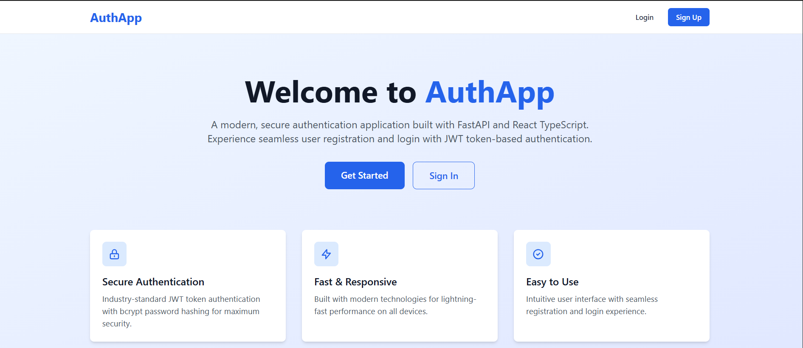
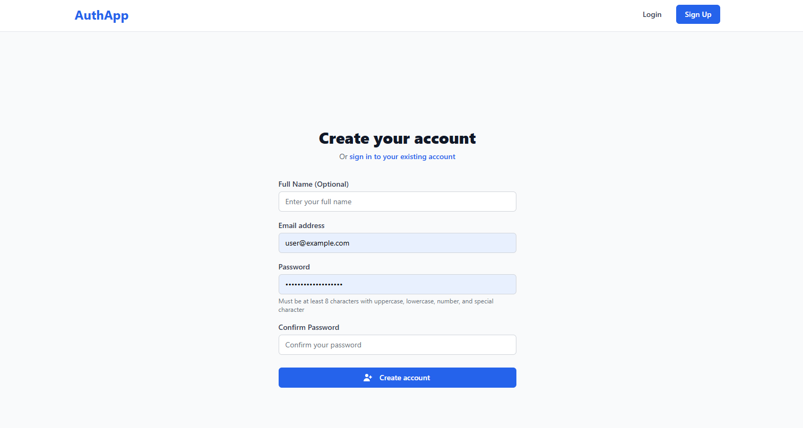
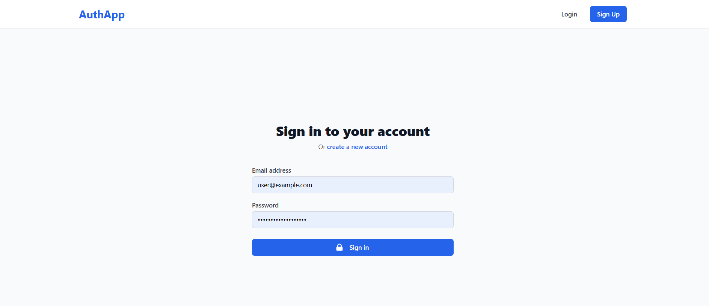
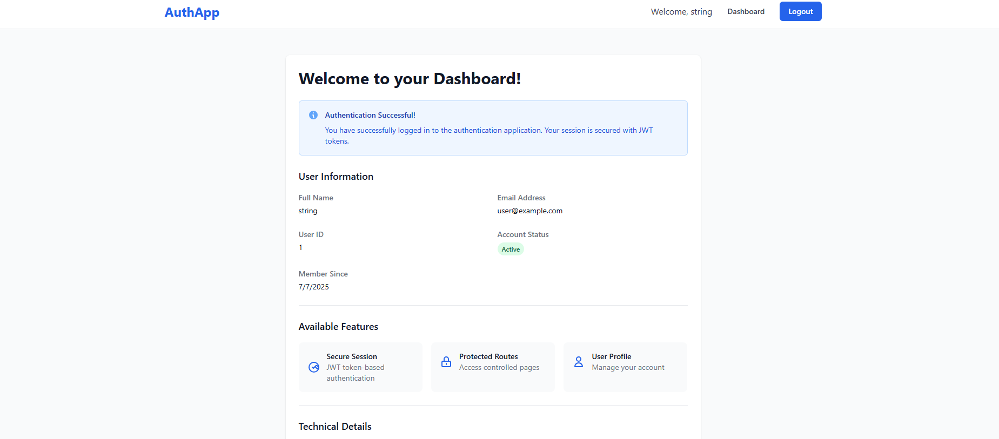

# Authentication App

A modern, secure authentication application built with **FastAPI** (backend) and **React TypeScript** (frontend), featuring JWT token-based authentication, SQLite database, and responsive design.

## 🚀 Features

- **Secure Authentication**: JWT tokens with bcrypt password hashing
- **User Registration & Login**: Email and password-based authentication
- **Protected Routes**: Access control for authenticated users
- **Responsive Design**: Mobile-first approach with Tailwind CSS
- **Modern Tech Stack**: FastAPI + React TypeScript
- **Input Validation**: Client-side and server-side validation
- **Token Refresh**: Automatic token refresh mechanism
- **SQLite Database**: Lightweight database for development

## 📱 Application Screenshots

### Homepage
The landing page welcomes users with a clean design and clear call-to-action buttons.



### User Registration
A user-friendly registration form with real-time validation and password strength requirements.



### User Login
Secure login page with email and password authentication.



### Dashboard
Protected dashboard page showing user information and application features.



## 🏗️ Tech Stack

### Backend
- **FastAPI**: Modern, fast web framework for building APIs
- **SQLite**: Lightweight SQL database
- **SQLAlchemy**: Python SQL toolkit and ORM
- **JWT**: JSON Web Tokens for authentication
- **bcrypt**: Password hashing
- **Pydantic**: Data validation using Python type annotations
- **Uvicorn**: ASGI server for FastAPI

### Frontend
- **React 18**: JavaScript library for building user interfaces
- **TypeScript**: Typed superset of JavaScript
- **Tailwind CSS**: Utility-first CSS framework
- **React Router**: Declarative routing for React
- **React Hook Form**: Performant forms with easy validation
- **Axios**: Promise-based HTTP client

## � User Flow & Features

### 1. User Registration Flow
Users can create new accounts with comprehensive validation:
- **Email validation** with format checking
- **Password strength requirements** (8+ characters, mixed case, numbers, special characters)
- **Confirm password** matching validation
- **Duplicate email prevention**
- **Automatic login** after successful registration


### 2. User Authentication Flow
Secure login process with JWT token management:
- **Email and password authentication**
- **JWT token generation** (access + refresh tokens)
- **Secure token storage** in localStorage
- **Automatic token refresh** mechanism
- **Remember user session** across browser sessions


### 3. Protected Dashboard Access
Authenticated users access a personalized dashboard:
- **User profile information** display
- **Account status** and creation date
- **Security features** overview
- **Technical stack** information
- **Protected route** demonstration


### 4. Responsive Design
The application works seamlessly across all devices:
- **Mobile-first** responsive design
- **Tailwind CSS** for consistent styling
- **Modern UI components** with hover effects
- **Accessible navigation** and forms


## �📋 Prerequisites

- **Python 3.8+**
- **Node.js 16+**
- **npm** or **yarn**

## 🛠️ Installation & Setup

### Backend Setup

1. **Navigate to backend directory**:
   ```bash
   cd backend
   ```

2. **Create virtual environment**:
   ```bash
   python -m venv venv
   ```

3. **Activate virtual environment**:
   ```bash
   # Windows
   venv\Scripts\activate
   
   # macOS/Linux
   source venv/bin/activate
   ```

4. **Install dependencies**:
   ```bash
   pip install -r requirements.txt
   ```

5. **Start the backend server**:
   ```bash
   python run.py
   ```
   
   Or using uvicorn directly:
   ```bash
   uvicorn app.main:app --reload --host 127.0.0.1 --port 8000
   ```

The backend API will be available at: `http://localhost:8000`

API Documentation: `http://localhost:8000/docs`

### Frontend Setup

1. **Navigate to frontend directory**:
   ```bash
   cd frontend
   ```

2. **Install dependencies**:
   ```bash
   npm install
   ```

3. **Start the development server**:
   ```bash
   npm start
   ```

The frontend application will be available at: `http://localhost:3000`

## � Git Repository Setup

### Initialize Git Repository

If you want to set up version control for your project:

```bash
# Navigate to project root
cd "Auth App"

# Initialize git repository
git init

# Add all files (gitignore will handle exclusions)
git add .

# Create initial commit
git commit -m "Initial commit: Authentication app with FastAPI and React"

# Add remote repository (optional)
git remote add origin https://github.com/yourusername/auth-app.git

# Push to remote (optional)
git push -u origin main
```

### Important Git Notes

- `.env` files are excluded from version control for security
- Database files (`*.db`) are not tracked
- `node_modules/` and Python `__pycache__/` are excluded
- Virtual environment directories are ignored
- Build directories are not tracked

## �🔧 Configuration

### Version Control Setup

The project includes comprehensive `.gitignore` files to exclude sensitive and generated files:

- **Root `.gitignore`**: General project exclusions
- **Backend `.gitignore`**: Python-specific exclusions (virtual env, bytecode, database files)
- **Frontend `.gitignore`**: Node.js and React-specific exclusions (node_modules, build files)

**Important**: The `.env` files containing environment variables are excluded from version control for security.

### Backend Configuration

Environment variables can be set in `backend/.env`:

```env
SECRET_KEY=your-secret-key-here-change-in-production
ALGORITHM=HS256
ACCESS_TOKEN_EXPIRE_MINUTES=30
DATABASE_URL=sqlite:///./app.db
CORS_ORIGINS=["http://localhost:3000", "http://127.0.0.1:3000"]
```

### Frontend Configuration

The frontend is configured to connect to the backend at `http://localhost:8000`. To change this, modify the `API_BASE_URL` in `src/services/api.ts`.

## 📚 API Documentation

### Authentication Endpoints

- `POST /auth/register` - User registration
- `POST /auth/login` - User login
- `POST /auth/refresh` - Refresh access token
- `POST /auth/logout` - User logout

### User Endpoints

- `GET /users/me` - Get current user profile

### Example API Usage

#### Register a new user:
```bash
curl -X POST "http://localhost:8000/auth/register" \
  -H "Content-Type: application/json" \
  -d '{
    "email": "user@example.com",
    "password": "SecurePass123!",
    "confirm_password": "SecurePass123!",
    "full_name": "John Doe"
  }'
```

#### Login:
```bash
curl -X POST "http://localhost:8000/auth/login" \
  -H "Content-Type: application/json" \
  -d '{
    "email": "user@example.com",
    "password": "SecurePass123!"
  }'
```

## 🔒 Security Features

- **Password Requirements**: Minimum 8 characters with uppercase, lowercase, number, and special character
- **JWT Tokens**: Secure token-based authentication
- **Password Hashing**: bcrypt with salt rounds
- **CORS Protection**: Configured for frontend domain
- **Input Validation**: Server-side and client-side validation
- **Token Expiration**: Automatic token expiry and refresh

## 🧪 Testing

### Backend Testing
```bash
cd backend
python -m pytest
```

### Frontend Testing
```bash
cd frontend
npm test
```

## 📁 Project Structure

```
auth-app/
├── .gitignore                   # Root-level git exclusions
├── README.md                    # Project documentation
├── backend/
│   ├── .gitignore              # Backend-specific exclusions
│   ├── app/
│   │   ├── __init__.py
│   │   ├── main.py              # FastAPI application
│   │   ├── config.py            # Configuration settings
│   │   ├── database.py          # Database setup
│   │   ├── models.py            # SQLAlchemy models
│   │   ├── schemas.py           # Pydantic schemas
│   │   ├── auth.py              # Authentication utilities
│   │   ├── crud.py              # Database operations
│   │   ├── dependencies.py      # FastAPI dependencies
│   │   └── routers/
│   │       ├── __init__.py
│   │       ├── auth.py          # Authentication routes
│   │       └── users.py         # User routes
│   ├── requirements.txt
│   ├── .env                     # Environment variables (not tracked)
│   ├── .env.example             # Environment template
│   └── run.py                   # Startup script
├── frontend/
│   ├── .gitignore              # Frontend-specific exclusions
│   ├── public/
│   │   └── index.html
│   ├── src/
│   │   ├── components/
│   │   │   ├── Navbar.tsx
│   │   │   └── ProtectedRoute.tsx
│   │   ├── contexts/
│   │   │   └── AuthContext.tsx
│   │   ├── pages/
│   │   │   ├── HomePage.tsx
│   │   │   ├── LoginPage.tsx
│   │   │   ├── RegisterPage.tsx
│   │   │   └── DashboardPage.tsx
│   │   ├── services/
│   │   │   └── api.ts
│   │   ├── types/
│   │   │   └── auth.ts
│   │   ├── App.tsx
│   │   ├── index.tsx
│   │   └── index.css
│   ├── package.json
│   ├── tailwind.config.js
│   └── tsconfig.json
├── docs/
│   ├── prd.md                   # Product Requirements Document
│   └── checklist.md             # Development checklist
└── images/                      # Application screenshots
    ├── homepage.png
    ├── login.png
    ├── signup.png
    └── dashboard.png
```

## 🚀 Deployment

### Backend Deployment

1. **Set environment variables for production**
2. **Use a production database** (PostgreSQL/MySQL instead of SQLite)
3. **Use a production ASGI server** like Gunicorn with Uvicorn workers
4. **Enable HTTPS**
5. **Set up monitoring and logging**

### Frontend Deployment

1. **Build the production bundle**:
   ```bash
   npm run build
   ```

2. **Deploy the `build` folder** to your static hosting service
3. **Configure environment variables** for production API endpoints

## 🐛 Troubleshooting

### Common Issues

1. **CORS errors**: Ensure backend CORS settings include your frontend URL
2. **Database errors**: Check if SQLite database file has proper permissions
3. **Token expiration**: Implement proper token refresh logic
4. **Port conflicts**: Ensure ports 3000 and 8000 are available

### Development Tips

- Use the browser's Developer Tools to debug API calls
- Check the FastAPI documentation at `/docs` for API testing
- Monitor the backend logs for error details
- Use React Developer Tools for frontend debugging

## 📄 License

This project is licensed under the MIT License.

## 🤝 Contributing

1. Fork the repository
2. Create a feature branch
3. Make your changes
4. Add tests if applicable
5. Submit a pull request

## 📞 Support

For support and questions, please check the documentation or open an issue in the repository.

## 🎬 Live Demo

### Try the Application
1. **Start both servers** following the installation guide above
2. **Visit** `http://localhost:3000` to see the homepage
3. **Register** a new account with your email
4. **Login** and explore the protected dashboard
5. **Test** the logout and token refresh functionality

### API Testing
- **API Documentation**: Visit `http://localhost:8000/docs` for interactive Swagger documentation
- **Test Endpoints**: Use the built-in API testing interface
- **Monitor Logs**: Check terminal output for request/response debugging

### Screenshots Gallery

| Page | Description | Screenshot |
|------|-------------|------------|
| **Homepage** | Landing page with features showcase |  |
| **Registration** | Sign up form with validation |  |
| **Login** | Authentication page |  |
| **Dashboard** | Protected user area |  |

---

**Happy coding!** 🎉
